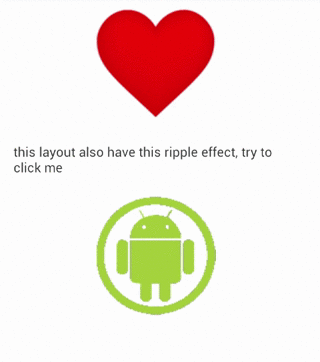

#Making views have ripple effect
================================

Android is not very developer friendly when we have to make that our views have this beautiful ripple effect when we press them, and is still worse when we have to make it compatible with previous versions, that's the reason why I created **RippleDrawableHelper.createRippleDrawable(View v, int color)** method.

How it works and why is so much awesome?

Android lollipop includes a new Drawable called RippleDrawable, this is the responsible of creating this pretty effect, but thanks to android it don't work on previous Android version, then is when this method appears, if you are using lollipop version it will return a RippleDrawable with a ripple of the color of your own choice and it adapts perfectly into the previous drawable that the view contained, but if you are using a previous version (instead of crash, thanks android!) what id does it replaces the pressed color, you won't have the ripple effect but at least you have an equivalent behavior to previous versions.

And look how easily you can create this views (Android Lollipop left, Android Jelly Bean right).

[](demo)[](demo)

> **:paperclip:** The heart is a xml vector file in Lollipop, in Jelly Bean is a png file, the layout is a RelativeLayout and the android is a png image in both cases.

> **:paperclip:** In Android Jelly Bean there are two images for the drawables :(, one for normal state and the other for pressed.


```xml

	<!-- Do you see all the extra layouts you have to add? No, that's because you don't need to create, and the code doesn't add any. -->

	<!-- heart -->
	<Button
        android:layout_width="wrap_content"
        android:layout_height="wrap_content"
        android:background="@drawable/heart"
        android:id="@+id/heart"
        android:layout_gravity="center"/>

    <!-- relative layout -->
    <RelativeLayout
        android:layout_width="fill_parent"
        android:layout_height="wrap_content"
        android:padding="20dp"
        android:id="@+id/rLayout">
        <TextView
            android:layout_width="wrap_content"
            android:layout_height="wrap_content"
            android:text="this layout also have this ripple effect, try to click me"/>
    </RelativeLayout>

    <!-- android -->
    <Button
        android:layout_width="wrap_content"
        android:layout_height="wrap_content"
        android:id="@+id/android"
        android:background="@mipmap/android"
        android:layout_gravity="center"/>
```

```java

	// Heart
	View b1 = findViewById(R.id.heart);
    b1.setBackground(RippleDrawableHelper.createRippleDrawable(b1, 0x80ffffff, R.mipmap.heart_dark));

    // Android
    View b3 = findViewById(R.id.android);
    b3.setBackground(RippleDrawableHelper.createRippleDrawable(b3, 0x88000000, R.mipmap.android_dark));

    // RelativeLayout
    View b2 = findViewById(R.id.rLayout);
    b2.setBackground(RippleDrawableHelper.createRippleDrawable(b2, getResources().getColor(android.R.color.holo_green_light)));

    b2.setOnClickListener(new View.OnClickListener() {
        @Override
        public void onClick(View v) {
            // needed to make the ripple effect, because the ripple effect is triguered once it has attached a ClickListener o TouchListener
        }
    });
```

##Usage

###Java
| Method  | Description |
| ------------- | ------------- |
| Drawable createRippleDrawable(View v, int color)  | In API 21+ returns a RippleDrawable with the ripple with the color assigned, in older versions returns a StateListDrawable|
| Drawable createRippleDrawable(View v, int color, Drawable d)  | In API 21+ returns a RippleDrawable with the ripple with the color assigned, in older versions returns a StateListDrawable, but when pressed it shows the drawable you assign (Ideal for images that work as buttons)|
| Drawable createRippleDrawable(View v, int color, int drawableResource)  | In API 21+ returns a RippleDrawable with the ripple with the color assigned, in older versions returns a StateListDrawable, but when pressed it shows the drawable you assign (Ideal for images that work as buttons) |


Next: [CHANGELOG](../Changelog.md)
Prev: [Making views have ripple effect](RippleDrawableHelper.md)
